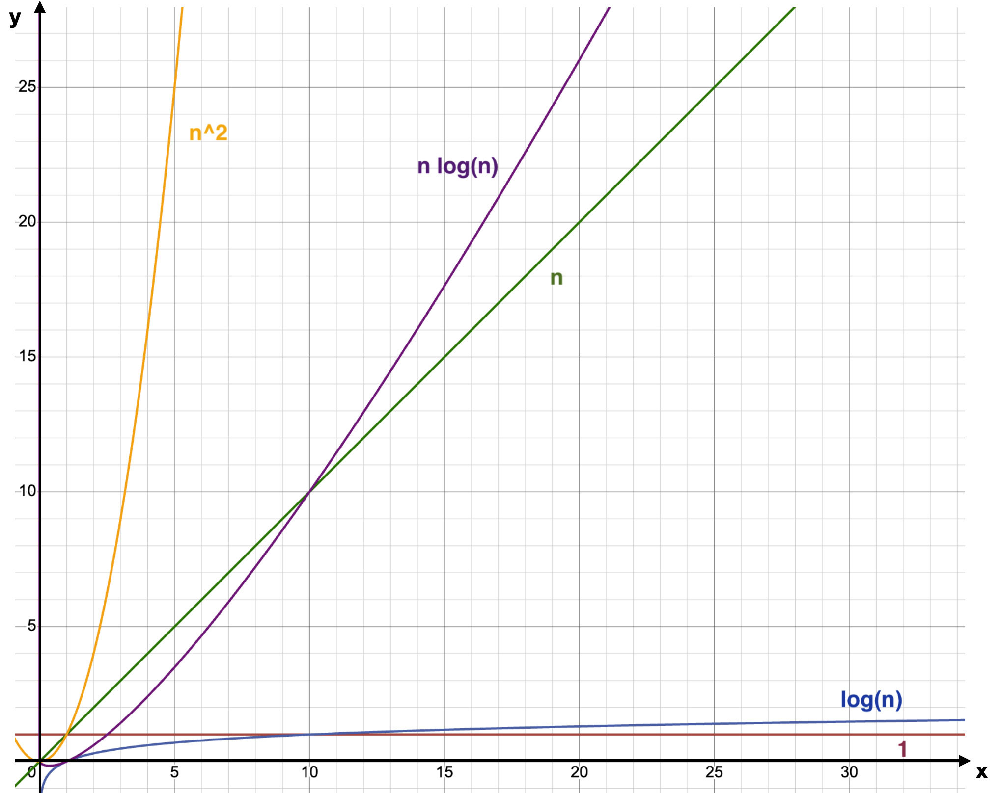

# Big O Notation 
It is what describes and shows the **growth rate** of an algorithm along with the increase in the input value.
The growth rate refers to how much **resources it requires as the input values increases**.

---
## Common Time Complexities

| Complexity   | Name                 | What it Means                                                        | Example                     |
|------------- |-------------------- |---------------------------------------------------------------------- |---------------------------- |
| `O(1)`       | Constant Time        | Takes the same time regardless of input size                         | Accessing an array element  |
| `O(log n)`   | Logarithmic Time     | Runtime grows slowly as input size increases                         | Binary Search               |
| `O(n)`       | Linear Time          | Runtime grows proportionally with input size                         | Looping through an array    |
| `O(n log n)` | Log-Linear Time      | Common in efficient sorting algorithms; slightly faster than linear  | Merge Sort, Quick Sort      |
| `O(n²)`      | Quadratic Time       | Runtime grows quadratically; inefficient for large inputs           | Bubble Sort, Insertion Sort |
---

